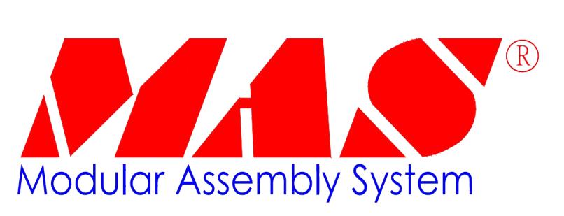

# MAS.Communication

<p align="center">
  
</p>

<p align="center">
  一个面向工业自动化的 .NET 多协议通信管理框架
</p>

<p align="center">
  <a href="https://mas-copilot.github.io/mas.communication-docs/index.html">📖 Documentation</a>
</p>

<p align="center">
  
  
  <a href="https://www.nuget.org/packages/MAS.Communication/">
    
  </a>
  
  
</p>

## ✨ MAS 开放源代码

> 该库是 MAS 开放源代码体系中的一部分，专注于工业自动化场景下的通信基础设施建设

如果你正在构建 WPF、WinUI、Worker Service 或 ASP.NET Core 的工业应用，
并希望用一致的方式管理 Modbus、MC、S7 以及后续更多协议，
那么 `MAS.Communication` 会是一个适合作为基础设施层的选择

## 🗺️ 发展路线

- [x] Modbus TCP（[Sockets](https://github.com/dotnet/runtime/tree/main/src/libraries/System.Net.Sockets)）
- [x] MC Protocol（[Sockets](https://github.com/dotnet/runtime/tree/main/src/libraries/System.Net.Sockets)）
- [x] S7 Protocol（[S7.Net](https://github.com/S7NetPlus/s7netplus)）
- [ ] OPC UA
- [ ] EtherNet/IP
- [ ] MQTT
- [ ] CANopen
- [ ] PROFINET

## ⚠️ 使用前提

在使用本项目之前，请确认你的应用满足以下条件：

- 使用 **现代 .NET 项目**
- 目标框架为 **.NET 8.0 及以上**
- 使用 **Microsoft.Extensions.DependencyInjection** 进行服务注册与解析
- 不支持仍运行在 **.NET Framework** 上的项目（未进行测试）
- 仅适合在 WPF / WinUI / Worker / ASP.NET Core 中集成

## 📦 NuGet

.NET CLI：

```bash
dotnet add package MAS.Communication
```

Package Manager：

```bash
Install-Package MAS.Communication
```

## 🚀 快速开始

以 **Modbus TCP** 为例，演示从 **服务注册 → 依赖注入 → 获取协议实例 → 建立连接 → 释放实例** 的流程

### 注册通信服务

在应用启动阶段注册通信框架：

```csharp
using MAS.Communication;
using Microsoft.Extensions.DependencyInjection;

ServiceCollection services = new();
services.AddCommunication();

ServiceProvider serviceProvider = services.BuildServiceProvider();
```

### 通信配置

具体协议通过扩展接口提供协议特有字段：

```csharp
using MAS.Communication.ModbusProtocol;

public sealed class ModbusTcpConfig : IModbusCommunicationConfig {
    public string ProtocolName => "ModbusTcp";

    public string Ip { get; set; } = "127.0.0.1";
    public int MaxRetries { get; set; } = 3;
    public int ReadTimeout { get; set; } = 3000;
    public int WriteTimeout { get; set; } = 3000;

    public short Port { get; set; } = 502;
    public byte UnitId { get; set; } = 1;

    public ModbusByteOrder ByteOrder { get; set; } = ModbusByteOrder.ABCD;
    public ModbusWordOrder WordOrder { get; set; } = ModbusWordOrder.HighLow;

    public bool UseOneBasedAddress { get; set; } = true;
}
```

### 依赖注入

```csharp
using MAS.Communication;

public sealed class DeviceService {
    private readonly IProtocolManager _protocolManager;

    public DeviceService(IProtocolManager protocolManager) {
        _protocolManager = protocolManager;
    }
}
```

### 协议实例

```csharp
// 强类型，无需显式转换
IModbusProtocol protocol = _protocolManager.GetOrCreate<IModbusProtocol>(config);

// 弱类型，需显式转换
IModbusProtocol protocol = (IModbusProtocol)_protocolManager.GetOrCreate(config);
```

### 设备连接

```csharp
// 建立连接
await protocol.ConnectAsync();

// 测试连接
await protocol.ProbeConnectionAsync();

// 关闭连接
protocol.Disconnect();
```

### 释放实例

使用`protocol.Dispose()` 时，管理器会自动将其从内部缓存中移除

```csharp
// 通过管理器释放
_protocolManager.Remove(protocol);

// 通过实例自身释放
protocol.Dispose();
```

有关更多 API 和示例，请参阅 [Documentation](https://mas-copilot.github.io/mas.communication-docs/index.html)

## 📖 项目文档

- 下载最新版本的 DocFX 可执行文件 [DocFX](https://github.com/dotnet/docfx/releases)
- 解压后，将`docfx.exe`文件所在的目录添加到系统的环境变量`PATH`中
- 使用`docfx --version`命令验证状态

**文档构建：**

```bash
# 进入文档目录
cd docs/

# 开始构建
docfx docfx.json

# 进入构建的目录
cd _site

# 启动服务器
docfx serve
```

每次向`main`分支推送代码时，仅当修改了`docs/`目录下的任意文件（或手动触发`docs-deploy`），才会通过`GitHub Actions`自动构建文档

## 😃 git commit emoji

| emoji | emoji代码       | commit 说明 |
| ----- | -------------- | ----------------------- |
| 🎉   | `:tada:`        | 初次提交                |
| ✨   | `:sparkles:`    | 新功能                  |
| ⚡️   | `:zap:`         | 性能改善                |
| 🐛   | `:bug:`         | 修复 Bug                |
| 🚑️   | `:ambulance:`   | 紧急修复 Bug            |
| 🎨   | `:art:`         | 改进代码结构/代码格式    |
| 🚚   | `:truck:`        | 移动或重命名文件、目录、命名空间等 |
| 💄   | `:lipstick:`    | 更新 UI 和样式文件      |
| 🔥   | `:fire:`        | 移除代码或文件           |
| 📝   | `:memo:`        | 撰写文档                |
| 🚀   | `:rocket:`      | 部署功能                |
| ✅   | `:white_check_mark:` | 添加或更新测试     |
| 🔒️   | `:lock:`        | 更新安全相关代码        |
| ⬆️   | `:arrow_up:`    | 升级依赖                |
| ⬇️   | `:arrow_down:`  | 降级依赖                |
| 🔀   | `:twisted_rightwards_arrows:` | 合并分支 |
| ⏪️   | `:rewind:`     | 回退到上一个版本         |
| 🔧   | `:wrench:`      | 修改配置文件            |
| 🗑️   | `:wastebasket:` | 删除不再需要的代码或文件 |
| ✏️   | `:pencil2:`     | 修正拼写或语法错误       |
| ♻️   | `:recycle:`     | 重构代码                |
| 💩   | `:poop:`        | 改进的(屎)坏(山)代码    |
| 👻   | `:ghost:`       | 添加或更新 GIF          |
| 👷   | `:construction_worker:` | 添加 或更新 CI 构建系统 |
| 🥚   | `:egg:`         | 添加或更新彩蛋          |
| 🏗️   | `:building_construction:` | 进行体系结构更改/重大重构 |
| 💡   | `:bulb:`        | 在源代码中添加或更新注释 |

## 📄 License

本项目基于 Apache License 2.0 开源

详见 [LICENSE](./LICENSE)
